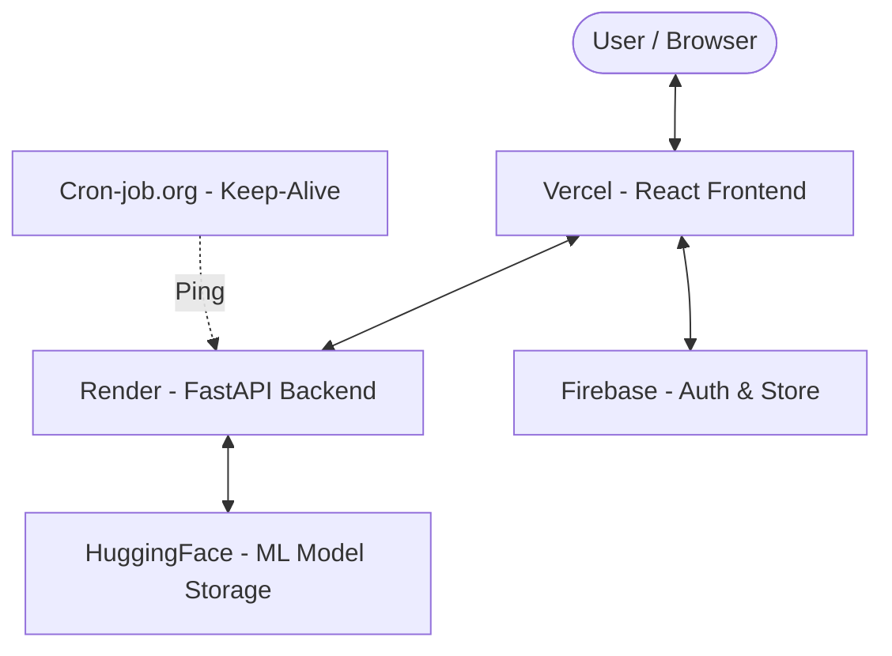

# 🛡️ ShieldSight - AI-Powered Phishing Detection


**ShieldSight** is an advanced phishing detection system leveraging **XGBoost** machine learning with **SHAP** (SHapley Additive exPlanations) for transparent, high-accuracy threat analysis. It achieves **95%+ accuracy** with a low false positive rate.

## ✨ Features

- **🤖 AI-Powered Detection**: Real-time URL analysis using a trained XGBoost model.
- **📊 SHAP Explainability**: Visualizes *why* a URL is flagged (e.g., suspicious domain length, obfuscation).
- **📁 Batch Processing**: Analyze bulk URLs via CSV upload with exportable results.
- **📈 History & Analytics**: Track past scans and view aggregate statistics.
- **🎨 Modern UI**: Responsive React dashboard with Dark/Light mode support.
- **📱 Mobile Optimized**: Fully functional on mobile devices with camera-based QR scanning.
- **🔐 Secure Architecture**: Firebase Authentication and encrypted data handling.

## 🌐 Live Demo

- **Main Dashboard**: [shieldsight.vercel.app](https://shieldsight.vercel.app)
- **Direct Link**: [Scan URLs Now](https://shieldsight.vercel.app/analyze)
- **API Health**: [Backend Status](https://shieldsight-gsnq.onrender.com/health)

## 🏗️ System Architecture



## 🛠️ Tech Stack

### Core Technologies
- **Frontend**: [React 19](https://react.dev), [Vite](https://vitejs.dev), [TypeScript](https://www.typescriptlang.org)
- **Backend**: [FastAPI](https://fastapi.tiangolo.com) (Python 3.11)
- **Machine Learning**: [XGBoost](https://xgboost.readthedocs.io), [SHAP](https://shap.readthedocs.io), [Scikit-learn](https://scikit-learn.org)
- **Styling**: [Tailwind CSS](https://tailwindcss.com), [Framer Motion](https://www.framer.com/motion)

### Service Infrastructure
- **Model Hosting**: [HuggingFace Hub](https://huggingface.co/aashif-dev/shieldsight-models)
- **Authentication**: [Firebase Auth](https://firebase.google.com/docs/auth)
- **Cloud Hosting**: [Vercel](https://vercel.com) (Frontend), [Render](https://render.com) (Backend)
- **Maintenance**: [Cron-job.org](https://cron-job.org)

## 📦 Installation & Setup

### Prerequisites
- Python 3.9+
- Node.js 18+
- Git

### 1. Clone the Repository
```bash
git clone https://github.com/MdAashif-h/ShieldSight.git
cd ShieldSight
```

### 2. Backend Setup
```bash
cd backend

# Create virtual environment
python -m venv venv
source venv/bin/activate  # On Windows: venv\Scripts\activate

# Install dependencies
pip install -r requirements.txt

# Create .env file
# Add HF_REPO_ID=aashif-dev/shieldsight-models

# Run the server
uvicorn app.main:app --reload
```
The API will be available at `http://localhost:8000`.

### 3. Frontend Setup
```bash
cd frontend

# Install dependencies
npm install

# Create .env file
# Add VITE_API_URL=http://localhost:8000
# Add your Firebase config keys

# Run development server
npm run dev
```
The app will be available at `http://localhost:5173`.

## 📊 Model Performance

Evaluated on the **PhiUSIIL** and **Alexa Top-1M** datasets:

- **Accuracy**: 95.2%
- **Precision**: 95.1%
- **Recall**: 95.3%
- **False Positive Rate**: < 4%

## 📄 License

This project is licensed under the MIT License - see the [LICENSE](LICENSE) file for details.

## 📧 Contact

- **GitHub**: [MdAashif-h](https://github.com/MdAashif-h)
- **Email**: faree.aashif@gmail.com

---
Made by [MdAashif-h](https://github.com/MdAashif-h)
